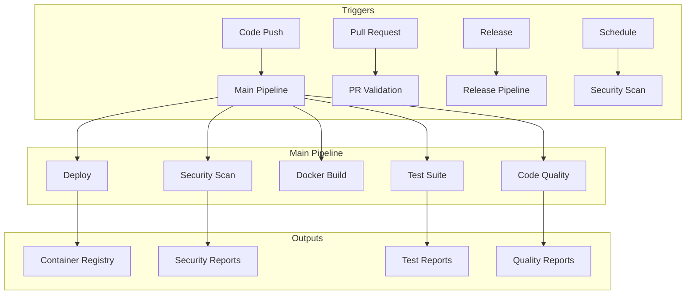

# CI/CD Pipeline Documentation

This document provides comprehensive information about SynthaTrial's CI/CD pipeline implementation using GitHub Actions.

## Overview

SynthaTrial uses a comprehensive CI/CD pipeline that automates:
- Multi-architecture Docker builds (AMD64, ARM64)
- Comprehensive testing (unit, integration, property-based)
- Security scanning and vulnerability assessment
- Code quality enforcement
- Automated deployment to container registries
- Release management and deployment

## Pipeline Architecture



## Workflows

### 1. Main Build Pipeline (`docker-build.yml`)

**Purpose:** Primary CI/CD pipeline for building, testing, and deploying SynthaTrial

**Triggers:**
- Push to `main` or `develop` branches
- Git tags (version releases)
- Pull requests to `main`
- Manual workflow dispatch

**Key Features:**
- Multi-architecture builds (AMD64, ARM64)
- Parallel test execution across Python versions
- Container security scanning with Trivy
- Performance testing and benchmarking
- Automated registry deployment

**Jobs:**
1. **Code Quality & Security** - Pre-commit hooks, linting, security analysis
2. **Test Suite** - Unit, integration, and property-based tests
3. **Docker Build** - Multi-arch builds for dev, prod, dev-enhanced targets
4. **Container Testing** - Startup validation and compose testing
5. **Multi-Architecture Validation** - Cross-platform compatibility
6. **Performance Testing** - Load testing and performance benchmarks
7. **Deployment** - Registry push and deployment status
8. **Notification & Reporting** - Build reports and notifications

### 2. Security Scanning (`security-scan.yml`)

**Purpose:** Comprehensive security analysis and vulnerability detection

**Triggers:**
- Daily schedule (2 AM UTC)
- Manual workflow dispatch with configurable scan types

**Scan Types:**
- **Code Security:** Bandit, Semgrep, secret detection
- **Dependency Security:** Safety, pip-audit vulnerability scanning
- **Container Security:** Trivy image and configuration scanning

**Features:**
- Configurable severity thresholds
- Automated issue creation for critical vulnerabilities
- Comprehensive security reporting
- Integration with security tools ecosystem

### 3. Release Pipeline (`release.yml`)

**Purpose:** Automated release management and deployment

**Triggers:**
- GitHub release publication
- Manual workflow dispatch with version specification

**Features:**
- Version validation and format checking
- Release-specific security validation
- Multi-environment deployment (staging/production)
- Post-deployment verification
- Automated rollback capabilities

**Environments:**
- **Staging:** Automated deployment for testing
- **Production:** Manual approval required

### 4. Pull Request Validation (`pr-validation.yml`)

**Purpose:** Fast feedback for pull request validation

**Triggers:**
- Pull request opened/updated
- Pull request reviews submitted

**Features:**
- Fast test execution for quick feedback
- Code quality validation
- Docker build testing
- Security impact assessment
- Performance impact analysis
- Automated PR comments with results

## Configuration

### Environment Variables

Configure these in **Settings > Secrets and variables > Actions**:

```bash
# Automatically provided
GITHUB_TOKEN              # GitHub API access

# Optional enhancements
DOCKER_HUB_USERNAME       # Docker Hub deployment
DOCKER_HUB_TOKEN          # Docker Hub authentication
SLACK_WEBHOOK_URL         # Slack notifications
TEAMS_WEBHOOK_URL         # Microsoft Teams notifications
```

### Workflow Customization

#### Registry Configuration
```yaml
env:
  REGISTRY: ghcr.io                    # Container registry URL
  IMAGE_NAME: ${{ github.repository }} # Image name pattern
  PLATFORMS: linux/amd64,linux/arm64  # Target architectures
```

#### Security Thresholds
```yaml
inputs:
  severity_threshold:
    default: 'medium'  # Options: low, medium, high, critical
```

#### Test Configuration
```yaml
strategy:
  matrix:
    python-version: ['3.10', '3.11']
    test-type: ['unit', 'integration', 'property']
```

## Usage Guide

### Local Development Workflow

1. **Setup Development Environment**
   ```bash
   make dev-setup
   make pre-commit-install
   ```

2. **Local CI/CD Simulation**
   ```bash
   make ci-test-local
   ```

3. **Validate CI/CD Configuration**
   ```bash
   make ci-validate
   make ci-status
   ```

### GitHub CLI Integration

#### Trigger Workflows
```bash
# Install GitHub CLI
# https://cli.github.com/

# Trigger main build
make gh-workflow-run WORKFLOW=docker-build.yml

# Trigger security scan
gh workflow run security-scan.yml \
  -f scan_type=all \
  -f severity_threshold=high

# Trigger release
gh workflow run release.yml \
  -f version=v1.2.0 \
  -f environment=staging
```

#### Monitor Workflows
```bash
# Check workflow status
make gh-workflow-status

# View specific run logs
make gh-workflow-logs RUN_ID=12345

# Download artifacts
gh run download <run-id>
```

### Multi-Architecture Builds

#### Local Multi-Arch Testing
```bash
# Setup buildx
docker buildx create --name synthatrial-builder --use

# Test multi-arch build
make build-multi-arch

# Build and push to registry
make build-and-push REGISTRY=ghcr.io/your-org TAG=latest
```

#### Registry Deployment
```bash
# Automatic deployment (on main branch)
git push origin main

# Manual deployment
make build-and-push REGISTRY=your-registry.com TAG=v1.0.0
```

## Artifacts and Reports

### Build Artifacts
- **test-results-*** - Test execution results and coverage reports
- **security-reports** - Comprehensive security analysis
- **container-security-scan** - Container vulnerability assessments
- **build-report** - Complete build summary and status

### Security Artifacts
- **code-security-reports** - Source code security analysis
- **dependency-security-reports** - Dependency vulnerability reports
- **container-security-reports-*** - Container-specific security scans
- **security-summary-report** - Consolidated security overview

### Accessing Artifacts
```bash
# Via GitHub CLI
gh run download <run-id> -n artifact-name

# Via GitHub UI
# Go to Actions > Workflow Run > Artifacts section
```

## Monitoring and Alerting

### Workflow Status Badges

Add to your README.md:
```markdown
[](https://github.com/your-org/synthatrial/actions/workflows/docker-build.yml)
[](https://github.com/your-org/synthatrial/actions/workflows/security-scan.yml)
[](https://github.com/your-org/synthatrial/actions/workflows/release.yml)
```

### Notification Integration

#### Slack Integration
```yaml
# Add to workflow
- name: Notify Slack
  if: failure()
  uses: 8398a7/action-slack@v3
  with:
    status: failure
    webhook_url: ${{ secrets.SLACK_WEBHOOK_URL }}
```

#### Teams Integration
```yaml
# Add to workflow
- name: Notify Teams
  if: always()
  uses: skitionek/notify-microsoft-teams@master
  with:
    webhook_url: ${{ secrets.TEAMS_WEBHOOK_URL }}
```

## Security Best Practices

### Vulnerability Management
1. **Daily Security Scans** - Automated vulnerability detection
2. **Severity Thresholds** - Configurable failure criteria
3. **Automated Issues** - Critical vulnerability tracking
4. **Dependency Updates** - Regular security updates

### Secret Management
1. **GitHub Secrets** - Secure credential storage
2. **Environment Isolation** - Separate staging/production secrets
3. **Rotation Policies** - Regular credential rotation
4. **Audit Logging** - Secret access monitoring

### Container Security
1. **Multi-Stage Builds** - Minimal attack surface
2. **Non-Root Users** - Principle of least privilege
3. **Security Scanning** - Comprehensive vulnerability assessment
4. **Image Signing** - Supply chain security

## Performance Optimization

### Build Performance
- **Build Cache** - GitHub Actions cache for faster builds
- **Parallel Execution** - Matrix strategy for concurrent jobs
- **Conditional Execution** - Skip unnecessary jobs
- **Resource Optimization** - Efficient resource utilization

### Test Performance
- **Parallel Testing** - pytest-xdist for concurrent execution
- **Test Selection** - Smart test filtering
- **Fast Feedback** - Quick validation for PRs
- **Timeout Management** - Prevent hanging tests

## Troubleshooting

### Common Issues

#### Build Failures
```bash
# Check build logs
gh run view --log

# Re-run failed jobs
gh run rerun --failed

# Local debugging
make ci-test-local
```

#### Security Scan Failures
```bash
# View security reports
gh run download <run-id> -n security-summary-report

# Local security scan
make container-security-scan

# Check specific vulnerabilities
trivy image synthatrial:latest
```

#### Multi-Architecture Issues
```bash
# Check buildx setup
docker buildx ls

# Test local multi-arch
docker buildx build --platform linux/amd64,linux/arm64 -t test .

# Debug platform issues
docker buildx inspect synthatrial-builder
```

### Performance Issues
```bash
# Check workflow timing
gh run view <run-id>

# Analyze build cache usage
# Review cache hit rates in workflow logs

# Profile test execution
pytest --durations=10
```

### Debugging Workflows
```bash
# Enable debug logging
# Add to workflow:
env:
  ACTIONS_STEP_DEBUG: true
  ACTIONS_RUNNER_DEBUG: true

# Local workflow testing
act -j build  # Requires nektos/act
```

## Integration with SynthaTrial

### Docker Integration
- Uses existing Dockerfiles and compose configurations
- Integrates with Makefile commands
- Leverages existing entrypoint scripts
- Supports all deployment modes (dev, prod, enhanced)

### Testing Integration
- Executes existing test suites
- Supports property-based testing with Hypothesis
- Integrates with coverage reporting
- Validates containerized environments

### Security Integration
- Uses SynthaTrial's security scanner
- Integrates with monitoring systems
- Validates SSL certificate management
- Supports production security requirements

## Best Practices

### Development Workflow
1. **Feature Branches** - Isolated development
2. **PR Validation** - Automated quality gates
3. **Code Review** - Human oversight
4. **Automated Testing** - Comprehensive validation
5. **Security Scanning** - Continuous security assessment

### Release Management
1. **Semantic Versioning** - Clear version strategy
2. **Release Notes** - Comprehensive change documentation
3. **Staged Deployment** - Gradual rollout process
4. **Rollback Procedures** - Quick recovery mechanisms
5. **Post-Deployment Monitoring** - Health validation

### Security Practices
1. **Shift-Left Security** - Early vulnerability detection
2. **Automated Scanning** - Continuous security assessment
3. **Vulnerability Management** - Systematic issue resolution
4. **Compliance Monitoring** - Regulatory requirement adherence
5. **Incident Response** - Security event handling

## Support and Maintenance

### Regular Maintenance
- **Weekly:** Review security scan results
- **Monthly:** Update dependencies and base images
- **Quarterly:** Review and update CI/CD configurations
- **Annually:** Comprehensive security audit

### Support Resources
- **GitHub Actions Documentation:** https://docs.github.com/en/actions
- **Docker Documentation:** https://docs.docker.com/
- **Security Tools:** Trivy, Bandit, Safety documentation
- **SynthaTrial Documentation:** `docs/` directory

### Getting Help
1. **Check Workflow Logs** - GitHub Actions interface
2. **Review Documentation** - This guide and tool docs
3. **Local Debugging** - Use Makefile commands
4. **Create Issues** - Use GitHub issue templates
5. **Community Support** - GitHub Discussions or relevant forums
